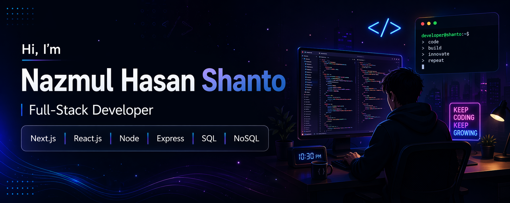
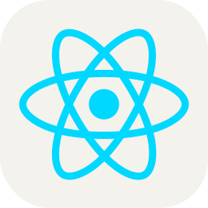
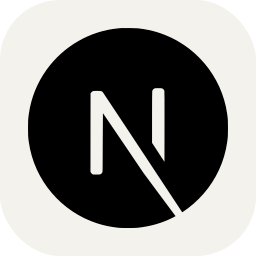
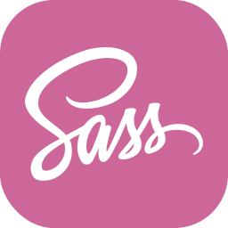
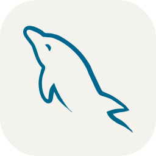
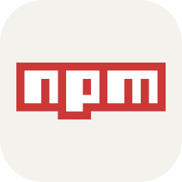

<h1 align="center">
  <a href="https://git.io/typing-svg">
   
  </a>
</h1>
<br/>

👇 Hit in your console or terminal to connect with me.

```
npx nazmul
```

<div align="center" style="display: flex; justify-content: center; align-items: center; gap: 6px; flex-wrap:wrap">

<p style="font-size:16px;">Let's connect:</p>

<a href="https://www.linkedin.com/in/nazmul-hasan-shanto-a67041182">

</a>
<a href="https://github.com/NazmulHasan18">

</a>
<a href="https://www.facebook.com/smnazmul.hasan.1829">

</a>
<a href="https://dev.to/nazmul_hasanshanto_572e5"> </a>
<a href="mailto:nazmulhasanshanto13@gmail.com"> </a>

</div>
<hr/>

<div align="center">
  <strong>
Hey, I'm Nazmul 👋

A Full Stack Web Engineer who loves turning complex problems into clean, scalable solutions.
I work across the entire stack — React & Next.js on the frontend, Node.js & Express on the backend,
and MongoDB or PostgreSQL under the hood.

I also build cross-platform mobile apps with React Native, architect microservices that don't fall apart
under pressure, and explore Blockchain as an IEEE researcher in my spare time.

When I'm not coding, I'm probably reading about systems design or optimizing something that didn't need optimizing.</strong>

</div>


### Talking about Personal Stuff:

<ul style="list-style-type: none; padding-left: 0;">
  <li>🛠 &nbsp; I’m currently working with <strong>TS, Next.js, Node, Express, MongoDB & Redux.</strong></li>
  <li>🚀 &nbsp; I’m currently deeply exploring <strong>Prisma, Docker.</strong></li>
  <li>📫 &nbsp; Reach me out: <strong>nazmulhasanshanto13@gmail.com</strong></li>
</ul>

### My Absolute Favorites:

<ul style="list-style-type: none; padding-left: 0;">
  <li>💻 &nbsp; I love exploring new technologies and building cool stuff.</li>
  <li>🍕 &nbsp; Meetups & Tech Events & Doing Math.</li>
</ul>

<hr/>

<h2 align="center">🔥 Languages & Frameworks & Tools 🔥</h2>

<div align="center">
  <code></code>
  <code></code>
  <code></code>
  <code></code>
  <code></code>
  <code></code>
  <code></code>
  <code></code>
  <code></code>
  <code></code>
  <code></code>
  <code></code>
  <code></code>
  <code></code>
  <code></code>
  <code></code>
  <code></code>
  <code></code>
  <code></code>
  <code></code>
</div>

<br/>

## 📊 This Week I Coded In

<!--START_SECTION:waka-->
**I'm an Early 🐤** 

```text
🌞 Morning                749 commits         ████░░░░░░░░░░░░░░░░░░░░░   16.13 % 
🌆 Daytime                2383 commits        █████████████░░░░░░░░░░░░   51.31 % 
🌃 Evening                1463 commits        ████████░░░░░░░░░░░░░░░░░   31.50 % 
🌙 Night                  49 commits          ░░░░░░░░░░░░░░░░░░░░░░░░░   01.06 % 
```
📅 **I'm Most Productive on Tuesday** 

```text
Monday                   824 commits         ████░░░░░░░░░░░░░░░░░░░░░   17.74 % 
Tuesday                  881 commits         █████░░░░░░░░░░░░░░░░░░░░   18.97 % 
Wednesday                842 commits         █████░░░░░░░░░░░░░░░░░░░░   18.13 % 
Thursday                 762 commits         ████░░░░░░░░░░░░░░░░░░░░░   16.41 % 
Friday                   723 commits         ████░░░░░░░░░░░░░░░░░░░░░   15.57 % 
Saturday                 502 commits         ███░░░░░░░░░░░░░░░░░░░░░░   10.81 % 
Sunday                   110 commits         █░░░░░░░░░░░░░░░░░░░░░░░░   02.37 % 
```


📊 **This Week I Spent My Time On** 

```text
💬 Programming Languages: 
No Activity Tracked This Week
```


 Last Updated on 12/04/2026 20:20:58 UTC
<!--END_SECTION:waka-->

---

<div align="center">

### 😄 Before You Go...

_Every great developer needs a laugh break!_


_Thanks for visiting! Come back anytime — I'll have fresh code and fresh jokes_ 😄

<br/>


**Made with ❤️ and too much ☕ by Nazmul**

</div>
